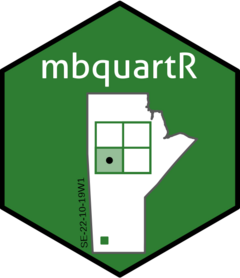
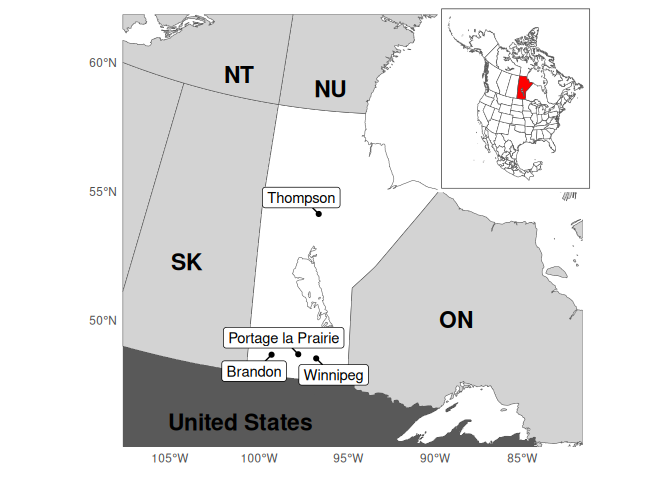

<!-- README.md is generated from README.Rmd. Please edit that file -->

# mbquartR <a href="https://docs.ropensci.org/mbquartR/"></a>

<!-- badges: start -->

[](https://ropensci.r-universe.dev)
[](https://app.codecov.io/gh/ropensci/mbquartR?branch=main)
[](https://github.com/ropensci/mbquartR/actions/workflows/R-CMD-check.yaml)

[](https://github.com/ropensci/mbquartR/actions?query=workflow%3Apkgcheck)
[](https://github.com/ropensci/software-review/issues/658)
<!-- badges: end -->

The goal of `mbquartR` is to provide an easy way to download the
Manitoba Original Survey Legal Descriptions data from
[DataMB](https://geoportal.gov.mb.ca/) and then to locate quarter
sections, and other land division types, in the province of Manitoba.
You can search by legal land description (e.g., NE-11-33-29W1) or by
lat/long coordinates (e.g., -101.4656, 51.81913). There is also a
convenient map function that plots the centres and outlines (polygons)
of the quarter sections on a map.

The Manitoba Original Survey Legal Descriptions data set covers the
entire province of Manitoba and there are over 900,000 parcels of land
that have a legal land description. `mbquartR` was created for those who
work with geospatial data in Manitoba, particularly those who are
working with rural or farm parcels of land where the legal land
description is commonly used as the method of identifying the location.
`mbquartR` also allows users to quickly go back and forth between
geographic coordinates and the legal land description. Most mapping
applications (e.g., Google Maps) can not find or route to a legal land
description, but you can with coordinates!

Checkout the [mbquartR website](https://docs.ropensci.org/mbquartR/) for
vignettes/code examples.

## What is a quarter section?

A quarter section in Manitoba is a land unit measuring 160 acres (~64.8
ha), representing a quarter of a square mile. It originates from the
[Dominion Land Survey
system](https://en.wikipedia.org/wiki/Dominion_Land_Survey), introduced
in the late 19th century to organize the European settlement and
colonization of Western Canada. The grid system covers most of the
province of Manitoba and organizes land into a hierarchy of quarter
sections, sections, townships, and ranges.

## Data Sources

The full list of quarter sections and coordinates are downloaded from
[DataMB](https://geoportal.gov.mb.ca/). Note that occasionally this site
is unavailable, in this situation an [archived
version](https://github.com/ropensci/mbquartR/releases/) of the data is
downloaded from the package repository on GitHub.

## Installation

You can install the development version of `mbquartR` like so:

``` r
install.packages("mbquartR", repos = "https://ropensci.r-universe.dev")
```

## Where is Manitoba?

<div class="figure">


<p class="caption">
Location of the province of Manitoba and surrounding provinces and
territories of Ontario (ON), Saskatchewan (SK), Nunavut (NU), and
Northwest Territories (NT) within south-central Canada. Manitoban cities
with a population greater than 10,000. Inset: Location of Manitoba
within North America
</p>

</div>

## This package is primarily maintained by:

**Alex Koiter** (koitera@brandonu.ca;
[@alex-koiter](https://github.com/alex-koiter))

Brandon University

[Department of Geography &
Environment](https://www.brandonu.ca/geography/)

Brandon, Manitoba

Canada

## Access Constraints

The data is publicly available through the
[DataMB](https://geoportal.gov.mb.ca/), the province of Manitoba’s
public open data platform. The usage of this data is subject to the
[OpenMB Information and Data Use
License](https://www.gov.mb.ca/legal/copyright.html).

## Contributions

All suggestions are welcomed, big and small, on how to make this package
more robust, functional, and user friendly. Please read the
[contributing
guide](https://docs.ropensci.org/mbquartR/CONTRIBUTING.html) to learn
more.

## Code of Conduct

Please note that this project is released with a [Contributor Code of
Conduct](https://ropensci.org/code-of-conduct/). By participating in
this package development you agree to abide by its terms.

## About the logo

The logo features the outline of Manitoba with a stylized depiction of a
one-square-mile section of land, divided into four equal quarter
sections. One quarter section is highlighted, with its centre marked by
a point. In the southwest (lower-left) corner of the province, a small
green square and the label “SE-22-10-19W1” indicate the quarter section
where Brandon University is located.
