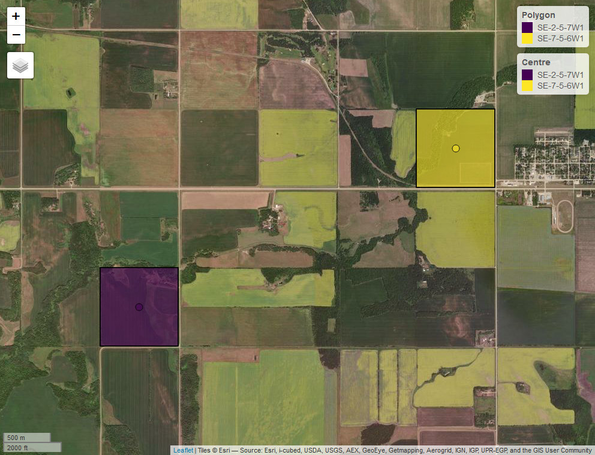

# Summary
The south-central Canadian province of Manitoba has an area of ~650,000 km2 and a population of ~1.3 million. The southern portion of the province is predominantly agriculture and represents ~10% of Canada’s farmland. The goal of `mbquartR` is to provide an easy way to download the Manitoba Original Survey Legal Descriptions data [@manitoba_2020] from [Data MB](https://geoportal.gov.mb.ca/) and then to locate quarter sections, and other land division types, in the province. Data MB is Manitoba's public platform for exploring, visualizing, and downloading geospatial Open Data. The Manitoba Original Survey Legal Descriptions data set covers the entire province of Manitoba and includes more than 900,000 parcels of land. These legal land descriptions originate from the Dominion Land Survey system, introduced in the late 19th century to organize the European settlement and colonization of Western Canada [@mckercher_1992]. `mbquartR` was created for those who work with geospatial data in Manitoba, particularly those who are working with rural or farm parcels of land where the legal land description is commonly used as the method of identifying the location. Prior to the widespread use of GPS technology, legal land descriptions were often used to georeference the collection of samples (e.g., soil testing) and other data.

## How do legal land descriptions for quarter section work in Manitoba?

Quarter sections are the most common type of land division in Manitoba and is a land unit measuring 64.8 ha, representing a quarter of a square mile. A legal land description for a quarter section consists of four values separated by a -

1. Quarter Section (SW)
2. Section (9)
3. Township (8)
4. Range (6E1)

For example, a legal land description of SW-9-8-6E1 can be interpreted as the Southwest Quarter of Section 9, Township 8, Range 6 East of the 1st Meridian. 

There are other types of land divisions in Manitoba where the size, shape, and naming convention can be different (such as River lots, Township lots, etc.)

# Statement of need
Currently, there are a few web-based tools that allow users to locate land parcels but do not allow for batch processing, do not return coordinates, and/or are fee based. Most mapping applications can not locate or route to a legal land description, but you can with coordinates. `mbquartR` allows users easily identify, search, and locate parcels of land. Users can search by legal land description (e.g., NE-11-33-29W1) or by lat/long coordinates (e.g., -101.4656, 51.81913). There is also a convenient map function that plots the centres and outlines (polygons) of the quarter sections on a map (Figure 1).

{ width=40% }

Figure 1. Locating two quarter sections on an interactive map showing the centres and outlines (polygons).

`mbquatR` is available on GitHub at <https://github.com/ropensci/mbquartR> and the r-universe at <https://ropensci.r-universe.dev/mbquartR>

# References
